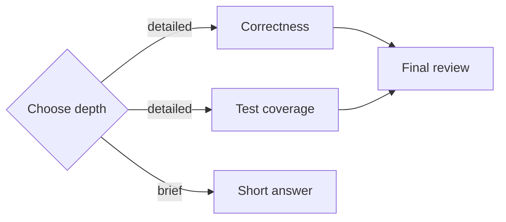
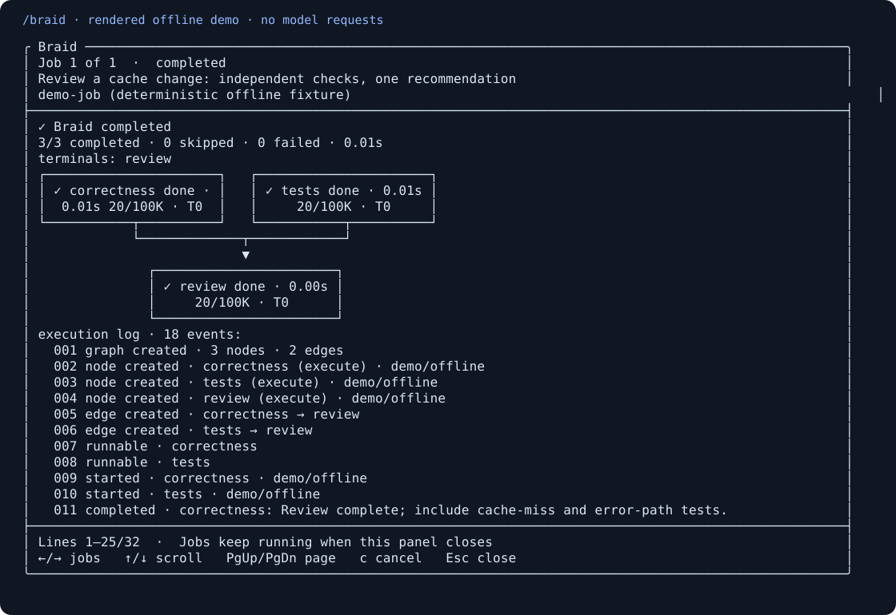

# Braid

Braid is a small execution runtime for dynamically constructed graphs of isolated
model invocations. A parent submits a complete DAG in one call; Braid resolves
routing and dependencies, runs independent nodes concurrently, and returns the
successful execution-terminal outputs. It is an agent primitive, not a workflow
builder.

[](https://github.com/Epsirom/braid/actions/workflows/ci.yml)
[](LICENSE)

**v0.1:** Experimental, TypeScript, Node.js 22+, ESM, no runtime dependencies.
The core has no Pi, provider SDK, or framework dependency.

## Why Braid?

For a code review, run correctness and test-coverage analysis independently,
then pass both results to a synthesis node. Add a decision when some tasks need
only a brief answer. Braid handles dependency readiness, conditional skips,
failed joins, per-node context, cancellation, and accounting around those calls.



Use it when independent reasoning branches and explicit handoffs help. A direct
model call or `Promise.all` is enough for a simple answer or independent calls
without routing or joins. Braid adds no persistence, workflow editor, or agent
framework. [Runnable examples](docs/examples.md) show the tradeoffs.

## Install in your application

```sh
npm install @chrok/braid
```

Save this as `example.mjs` and run `node example.mjs` (no API key needed):

```js
import { braid } from "@chrok/braid";
import { mkdtemp, rm } from "node:fs/promises";
import { tmpdir } from "node:os";
import { join } from "node:path";

// A non-Git directory keeps this text-only example outside workspace management.
const cwd = await mkdtemp(join(tmpdir(), "braid-hello-"));
try {
  const result = await braid({
    goal: "Try one isolated invocation.",
    nodes: [{ type: "execute", id: "answer", prompt: "Say hello." }],
    edges: [],
  }, {
    cwd,
    runner: async () => ({ output: "Hello from Braid." }),
  });
  console.log(result.terminalOutputs.answer.output);
  // Hello from Braid.
} finally {
  await rm(cwd, { recursive: true, force: true });
}
```

For a live provider, use the adapter in the API example below. Installation and
running the example above do not make model requests. In a Git checkout, Braid
creates node worktrees and may append a merge agent that can integrate changes
into the source checkout. Read [workspace behavior](#worktrees-and-merge-agents)
before running a custom adapter against a repository.

## Install in Pi

With Pi 0.87.1 and Node.js 22.19+:

```sh
pi install npm:@chrok/pi-braid
```

Run `/reload`, ask Pi to analyze a task with Braid, and open `/braid` to inspect
the job. The extension includes the matching core runtime; no checkout is needed.



This snapshot uses the actual panel renderer and fake responses. See the
[Pi guide](integrations/pi/README.md) for background jobs, cancellation, and local
installation, and [compatibility](docs/compatibility.md) for the tested versions.

## Develop from source

```sh
git clone https://github.com/Epsirom/braid.git
cd braid
npm ci
npm run check
npm test
npm run build
npm run demo
```

The demo uses a deterministic fake model runner and makes no network calls. To
run the same graph with an OpenAI-compatible Chat Completions endpoint:

```sh
# Set OPENAI_API_KEY and BRAID_MODEL in your environment first.
npm run demo -- --live
```

`OPENAI_BASE_URL` optionally changes the API root (for example,
`https://your-provider.example/v1`). Live mode makes billable model requests.
The adapter requires a model with function/tool calling support. No live provider
is needed for the test suite; its HTTP requests are intercepted in tests.

## API

After installing the package, submit the graph in one call;
configuration and the trusted provider adapter are separate from the graph data:

```ts
import { braid } from "@chrok/braid";
import { createOpenAICompatibleRunner } from "@chrok/braid/adapters/openai";

const apiKey = process.env.OPENAI_API_KEY;
const model = process.env.BRAID_MODEL;
if (!apiKey || !model) throw new Error("Set OPENAI_API_KEY and BRAID_MODEL");

const result = await braid({
  goal: "Assess a proposed change and give a recommendation.",
  nodes: [
    {
      type: "decision", id: "route", prompt: "Choose a brief answer or a detailed assessment.",
      choices: ["brief", "detailed"], model: process.env.BRAID_ROUTER_MODEL ?? model,
    },
    { type: "execute", id: "benefits", prompt: "Assess the potential benefits." },
    { type: "execute", id: "risks", prompt: "Assess the risks and unknowns." },
    { type: "execute", id: "answer", prompt: "Use the available context to give a recommendation." },
  ],
  edges: [
    { from: "route", to: "answer", choice: "brief" },
    { from: "route", to: "benefits", choice: "detailed" },
    { from: "route", to: "risks", choice: "detailed" },
    { from: "benefits", to: "answer" },
    { from: "risks", to: "answer" },
  ],
}, {
  runner: createOpenAICompatibleRunner({ apiKey }),
  defaultModel: model,
  maxConcurrency: 4,
  nodeTimeoutMs: 60_000,
  graphTimeoutMs: 300_000,
  onEvent: event => console.log(`[${event.type}]`, event),
});

console.log(result.status, result.terminalOutputs);
```

The detailed route starts `benefits` and `risks` concurrently. The brief route
skips both, propagates their inactivity, and runs `answer` with only `route`'s
output. The graph has no special fork, branch, or join nodes.

### Graph schema

```ts
type BraidNode =
  | { type: "execute"; id: string; prompt: string; model?: string }
  | { type: "decision"; id: string; prompt: string;
      choices: readonly string[]; model?: string }
  | { type: "merge"; id: string; prompt?: string; model?: string };

type Edge = { from: string; to: string; choice?: string };
type BraidInput = { goal: string; nodes: readonly BraidNode[]; edges: readonly Edge[] };
```

IDs are unique, non-empty strings. Prompts, goals, models, and choices must be
non-empty strings when present. Decision choices must be non-empty and unique.
Unknown fields, unsupported node types, missing references, duplicate exact
edges, and cycles are rejected. Cycles are rejected even if a decision might
make them inactive. Disconnected components are allowed; every root runs.
Distinct choices may connect the same node pair. Choices need not all have
outgoing edges, and decisions may themselves be terminal.

`validateGraph(input)` is also exported for validation without execution. It and
`braid` throw `GraphValidationError` for invalid graphs, before invoking a model.
Invalid runtime options throw `TypeError`. Execution failures return a result
with `status: "failed"` instead of discarding the run's successful outputs.

### Options

| Option | Default | Meaning |
| --- | --- | --- |
| `runner` | Required | A fresh, isolated invocation for each call |
| `defaultModel` | Adapter default | Overridden by each node's `model` |
| `cwd` | `process.cwd()` | Source checkout for core-managed worktrees; non-Git directories grant read-only capabilities |
| `maxConcurrency` | `4` | Maximum simultaneous runtime-managed node invocations; positive integer |
| `nodeTimeoutMs` | `60_000` | Separate deadline for each node, starting when it runs (not while queued) |
| `graphTimeoutMs` | `300_000` | Whole execution deadline, including node queueing; starts after validation |
| `signal` | None | Caller cancellation signal; aborts running nodes and marks queued nodes cancelled |
| `onEvent` | None | Live observer for graph/node creation, readiness, starts, handoffs, completions, skips, failures, and graph completion |

Timeouts must be positive finite milliseconds, at most `2_147_483_647`, or
`Infinity` to disable that deadline. Set both timeouts to `Infinity` to run
without a time limit; caller cancellation still works.

## Scheduling and routing semantics

Node states are explicit:

```text
pending -> runnable -> running -> completed | failed
pending -> skipped
pending | runnable -> skipped (graph timeout)
```

Edges are resolved from their source node's state:

| Source result | Outgoing edge state |
| --- | --- |
| Not yet finished | Unresolved |
| Completed, unlabelled edge | Active |
| Completed decision, matching choice | Active |
| Completed decision, nonmatching choice | Inactive |
| Skipped because all inputs were inactive | Inactive |
| Failed, unlabelled edge | Active (passes error and available output/workspace) |
| Failed decision, choice-labelled edge | Blocked |
| Skipped because of a failed dependency | Blocked |

Only decision nodes may have choice-labelled outgoing edges. Unlabelled edges
are unconditional, including edges from decisions. A single choice can activate
any number of edges. Choice routing requires successful decision completion.
A decision must call `decide` exactly once with exactly one declared choice;
missing, invalid, or repeated calls fail it. Catching a tool validation error
inside an adapter does not turn that invocation into a success.

A pending node waits until **all incoming edges are resolved**. Then:

1. Any blocked incoming edge makes it `skipped: upstream_failed`.
2. If it has incoming edges but none are active, it becomes `skipped: inactive`.
3. Otherwise it becomes `runnable` (including roots, which have no inputs).

Failures propagate as context through unconditional edges, allowing successors
and merge agents to inspect errors and recover partial work. Failed decisions
cannot activate choice-labelled edges; their unconditional successors can run.
Skip propagation uses topological order. There are no automatic retries. The
graph still reports failure if any node fails, even if a later node recovers its
work successfully.

## Execution events

The runtime keeps an immutable `events` log on every execution result and can
stream the same events through `options.onEvent`. Events are numbered and
timestamped. The log is diagnostic data and does not alter scheduling; observer
exceptions and rejected promises are ignored. Event payloads are frozen before
being retained and delivered.

The event sequence includes:

- `graph_created`, `node_created`, and `edge_created` when the submitted DAG is
  admitted; an appended final merge emits its own node/edge creation events.
- `node_runnable` and `node_started` when scheduling admits a node.
- `workspace_updated` for Git workspace preparation, checkpointing, and cleanup.
- `handoff` for every direct predecessor output passed to a downstream node,
  including the upstream decision when present.
- `node_completed`, `node_skipped`, and `node_failed`, including output,
  decision, model, usage, latency, skip reason, or error where applicable.
  A node start/completion/failure event is emitted only once the corresponding
  transition is admitted; a provider call that expires before admission has no
  `node_started` event.
- `graph_completed` with execution terminal IDs, or `graph_failed` with the
  representative error and any successful terminal IDs.

`node_completed` and `node_failed` include node latency; `node_completed` also
includes the selected decision and reported usage when available. Event output
is diagnostic context and may be previewed by an adapter; `BraidResult.events`
retains the complete event payloads.

The core event stream is intentionally a log, not a second control API. It does
not permit graph mutation or runtime intervention. A Pi adapter can use it to
render live topology, handoffs, failures, and active nodes without reconstructing
scheduler state from final results. Tool selection remains the responsibility of
the host agent; the optional Pi adapter supplies explicit proactive-use guidance
so Braid is considered for complex multi-branch reasoning without forcing it for
every prompt. In the Pi adapter, Git nodes can inspect and edit individual
worktrees; nodes outside Git stay read-only. Merge agents handle integration; the parent reviews results and runs shell commands and tests.

## Context isolation and model runners

The core accepts a `ModelRunner` function with this contract:

```ts
import type { ModelRequest } from "@chrok/braid";

type ModelRunner = (request: ModelRequest) => Promise<{
  output: string;
  model?: string;
  usage?: { inputTokens: number; outputTokens: number };
}>;
```

Each request contains the goal, node, resolved model, predecessor outputs,
execution IDs, and an abort signal. Decision nodes additionally receive
`request.decide(choice)`. Expose that callback as an actual model tool; do not
infer decisions by parsing the model's prose. Core assigns `request.workspace`,
provides local `request.git(args, input?)` operations in Git repositories, and
provides `request.merge.sources` and `request.merge.finish(dispositions)` to
merge agents. Adapters must enforce workspace capabilities and wrap mutating
file tools in `request.withWorkspaceWrite(operation)`, so cleanup waits for
in-flight writes and rejects later writes. Core Git mutations use this barrier.
The included Pi adapter provides guarded `write`/`edit` alongside its read tools.
Outside Git, adapters must provide read-only capabilities. Pi never provides
`bash`, `powershell`, or a test runner to nodes.

`request.predecessors` contains direct active predecessors in incoming-edge
order, including failures on unconditional edges with an `error` field. Each source appears once:

```json
[{ "nodeId": "route", "output": "Use a detailed comparison.", "decision": "detailed", "model": "router" }]
```

There is no parent conversation, global transcript, or automatic transitive
history. Each invocation gets fresh node/context objects, so modifying them
cannot affect the graph, another node, or recorded results. Both the submitted
input and options are snapshotted before asynchronous execution. Core manages
worktrees for all adapters; adapters decide which tools expose those capabilities.
Read tools follow the host filesystem permissions and are not a security sandbox.

### Worktrees and merge agents

In a Git checkout, execute and decision nodes receive detached worktrees under
`os.tmpdir()/braid-workspaces-*/<unique-id>`. The first node captures tracked
staged/unstaged changes, deletions, and non-ignored untracked files with a temporary
index. Snapshot creation preserves the source index, branch, and files. Ignored
files are not copied, and submodules are not initialized or recursively captured.
Pi rejects writes inside submodules. If a custom runner populates one, core
reports cleanup failure and retains the worktree rather than losing those files.
Empty repositories are supported. Nodes share this baseline until a merge ends;
subsequent nodes snapshot the current source checkout. Relative working directories
are preserved. Code changes do not implicitly flow into successor worktrees.

Add `{ type: "merge", id: "integrate" }` with incoming edges from any number of
sources. The merge agent receives predecessor errors, workspace paths, and Git
checkpoint refs and operates directly in the invoking checkout. **Core does not
run merge, cherry-pick, or apply automatically.** The agent reviews each source,
chooses which changes to integrate and how, resolves conflicts, then calls the
`finish_merge` tool with exactly one disposition and reason per source:

```json
{ "dispositions": [
  { "nodeId": "implementation", "disposition": "integrated", "reason": "Cherry-picked the reviewed checkpoint" },
  { "nodeId": "alternative", "disposition": "discarded", "reason": "The selected implementation supersedes this alternative" }
] }
```

Each merge request includes bounded changed-file lists, diff statistics and diff
previews in `mergeSources[].changes`, plus the invoking checkout's dirty status.
These are inspection aids; the agent still chooses every integration operation.
The `finish_merge` schema lists only the current source IDs and requires exactly
one decision per source. Invalid calls report missing, unexpected and duplicate
IDs so the agent can correct the call.

The model-facing `git` tool takes a `command` from the node's allowed command
enum and a separate `args` array. For example, `{"command":"show","args":["REF:path"]}`.
The programmatic `ModelRequest.git` API continues to accept the complete argument
array. Rejected commands include relevant supported alternatives; Braid never
silently substitutes a different Git operation. A first argument identical to
`command` is rejected before execution: `{ "command": "status", "args": ["status"] }`
would otherwise silently query a path named `status`. Use `args: ["--short"]`
for the full status, or `args: ["--", "status"]` for an intentional path filter;
same-named branches can use a full ref such as `refs/heads/diff`.

`archived` means integration failed. A missing finish call, unresolved conflicts,
or any archived source fails the merge node. Once the agent ends, core removes
its predecessor worktrees. Every removed source retains a checkpoint ref,
including intentionally discarded changes and ignored node output files. A
later consumer can inspect a removed source through `git show <checkpointRef>`.
Core also records `backupRef` for the source checkout before each merge agent.

When declared nodes settle, core releases worktrees whose contents match their
own snapshot, including those from failed nodes, as `discarded` with reason
`No changes from snapshot`. Their checkpoint refs point to the snapshot commit
without creating empty checkpoint commits; original node errors remain visible.
This comparison includes ignored output files. Explicit merge nodes still run
even when their sources have no changes.

When worktrees with changes remain, core appends an ordinary merge
agent named `__braid_merge__` (with a suffix if needed), using the run's default
model. It appears in results, events, usage, and terminal outputs. Merge nodes
are exclusive within a graph and serialized per source checkout across runs in
the same process. Avoid concurrent external edits to that checkout while merging;
this lock does not coordinate other processes or the parent editor.

Analysis-only graphs therefore keep their declared terminal outputs and do not
incur an automatic merge model call. Consumers should not assume that every Git
run includes `__braid_merge__`; use `terminalOutputs` for the completed endpoints.

Cancellation or graph timeout prevents new merge agents from starting. Core waits
for tracked writes, archives remaining work, and removes its worktrees. Merge
agent failure follows the same archive/cleanup path. It does not reset the source
checkout: partial integration or Git conflict state may remain for review, with
`backupRef` available for recovery. Filesystem/Git cleanup errors are reported as
`CLEANUP_FAILED` with retained workspace paths; a process crash cannot run cleanup.

`result.workspaces` and `node.workspace` report paths, states, reasons, and refs.
A cleaned worktree path is historical; use `checkpointRef` to recover its contents:

```sh
git show <checkpointRef>:path/to/file
git diff <snapshotCommit> <checkpointRef>
```

Recovery refs live under `refs/braid/checkpoints/` and `refs/braid/merge-backups/`.
After reviewing them, remove a particular ref with `git update-ref -d <ref>`.
They preserve recoverable Git objects without retaining worktree directories.

**The adapter is a trust boundary, not a security sandbox.** It must avoid shared
conversation state, expose only its declared capabilities, and forward `signal` to its provider.
The core never gives the model arbitrary code execution or a recursive Braid
tool. An optional Pi adapter translates this same contract without changing the
runtime; the core v0.1 package does not depend on Pi. See
[`integrations/pi/README.md`](integrations/pi/README.md) for installation and testing.

The included OpenAI-compatible adapter uses fresh Chat Completions contexts,
a strict `decide({ choice })` tool and one tool-free continuation for decisions.
Merge nodes use a local `git` / `finish_merge` tool loop; ordinary OpenAI nodes
have no filesystem tools. Pi exposes read and guarded write tools plus these
core Git/merge tools. Tool errors go back to merge agents for recovery. Both
adapters sum usage across their model calls and forward cancellation.
Pi writes reject external paths, Git metadata, symlinks, hard links, and special
files. These checks are not an OS sandbox against concurrent filesystem attacks.
See the [Pi filesystem capabilities](integrations/pi/README.md#node-filesystem-capabilities).

Pi tool and time budgets are unlimited by default. Its `options.maxToolRounds`
and `options.maxToolCalls` can impose positive integer limits per node; counts
include `decide` and rejected requests. Exceeding either limit fails the node
before executing the over-budget batch. Returning final text at the limit is
allowed. See the [Pi budget options](integrations/pi/README.md#node-filesystem-capabilities)
for configuration, including `nodeTimeoutMs` and `graphTimeoutMs`.

For finite budgets, Pi inserts a system reminder with remaining tool and time
budgets before every model call. The OpenAI-compatible adapter also refreshes
finite time-budget reminders before each request. The core supplies optional
`request.deadlines` on the `performance.now()` clock for adapters to calculate
remaining node and shared graph time. Reminders do not extend hard limits or
interrupt a model response already in progress. The core API's default timeouts
remain 60 seconds per node and 5 minutes per graph.

## Results, timeouts, and accounting

`BraidResult` contains:

- `status`: `completed` or `failed`.
- `terminalOutputs`: `{ [nodeId]: { output, decision?, model? } }` for completed
  nodes with **no active outgoing edges in this execution**. This includes a
  decision selecting a choice with no successor. A completed node does not
  become terminal merely because its active successor failed or was skipped.
- `nodes`: all node states plus available output, decision, model, usage, error,
  skip reason, start/end timestamps (Unix milliseconds), and latency in ms.
  Skipped nodes have no start time or latency. Nodes without a valid
  response have no output. A failed decision may retain its text and selected
  choice for debugging; choice-labelled edges still remain blocked.
- `workspaces`: Git workspace states and recovery refs, including cleaned sources.
- `events`: the immutable execution log described above. `onEvent` observes live
  copies of the same state transitions while the run is in progress.
- `metadata`: run/root identity, timestamps, monotonic latency, summed reported
  token usage, and `usageReportedNodes`. Missing usage is unknown, not proof of
  zero consumption. Usage counts only what the runner actually returns; a
  timeout or provider error may leave billable usage unavailable.
- `error`: one representative error when failed; `nodes` retains all errors.

A node timeout marks the running node `failed: NODE_TIMEOUT`; unconditional
successors can consume its error and partial workspace. A graph timeout marks running nodes `failed: GRAPH_TIMEOUT`,
skips queued/pending nodes with `graph_timeout`, and retains already completed
terminal outputs. Timers are cleared when no longer needed.

Timeouts abort the invocation signal and stop waiting for the model even if it
ignores cancellation. Workspace setup, tracked writes, and cleanup are awaited
to avoid deleting work still being written; this may extend total wall time. Late settlements cannot change the returned results, and late
rejections are observed. JavaScript cannot forcibly preempt synchronous work or
stop an uncooperative remote request: providers must honor cancellation to stop
resource consumption. Concurrency limits cover runtime-managed invocations;
uncancelled provider work after timeout can outlive a slot.

## Internal architecture and scope

- [`src/types.ts`](src/types.ts): public graph, provider, and result types.
- [`src/validate.ts`](src/validate.ts): strict validation, graph snapshot,
  dependency indexes, and iterative DAG validation.
- [`src/runtime.ts`](src/runtime.ts): edge resolution, explicit state transitions,
  bounded concurrent scheduling, invocation deadlines, execution events, and result accounting.
- [`src/workspaces.ts`](src/workspaces.ts): Git snapshots, checkpoint refs, merge
  serialization, local Git tools, and worktree cleanup.
- [`src/adapters/openai.ts`](src/adapters/openai.ts): optional provider translation.
- [`integrations/pi/`](integrations/pi/): thin Pi model-registry/tool adapter, Mermaid graph renderer, and live execution renderer (`display.ts`).
- [`test/`](test/): deterministic scheduling, execution-event, and intercepted HTTP/tool tests.

There is one in-memory execution context per run, plus a process-local mutex
per source checkout for merge agents. Worktree registration and removal are
serialized per common Git directory within the process; model calls remain
concurrent. These locks do not coordinate other processes. `rootRunId` equals
`runId` in v0.1. Centralized invocation admission and
usage aggregation leave places to thread a shared root budget in a future
nested-run implementation; **nested runs and shared budget enforcement are not
implemented**. The current scheduler deliberately rescans a small DAG after
completions; `onEvent` is an observer for diagnostics and visualization, not a
scheduler event bus.

Out of scope: loops, arbitrary code nodes, persistent workflows, saved templates,
resuming saved runs, human approval, editing UI, user-directed graph mutation,
and recursive Braid calls from model nodes.

## Contributing and project status

Start with [CONTRIBUTING.md](CONTRIBUTING.md) for setup and verification,
[ROADMAP.md](ROADMAP.md) for scope, and [CHANGELOG.md](CHANGELOG.md) for changes.
See [compatibility](docs/compatibility.md), [resource limits](docs/resource-limits.md),
and [scheduler benchmarks](docs/benchmark.md) before adopting Braid for a service.
Questions and bugs belong in [GitHub issues](https://github.com/Epsirom/braid/issues);
report vulnerabilities privately as described in [SECURITY.md](SECURITY.md).
Participation follows the [code of conduct](CODE_OF_CONDUCT.md).

## License

Braid is released under the [MIT License](LICENSE).
