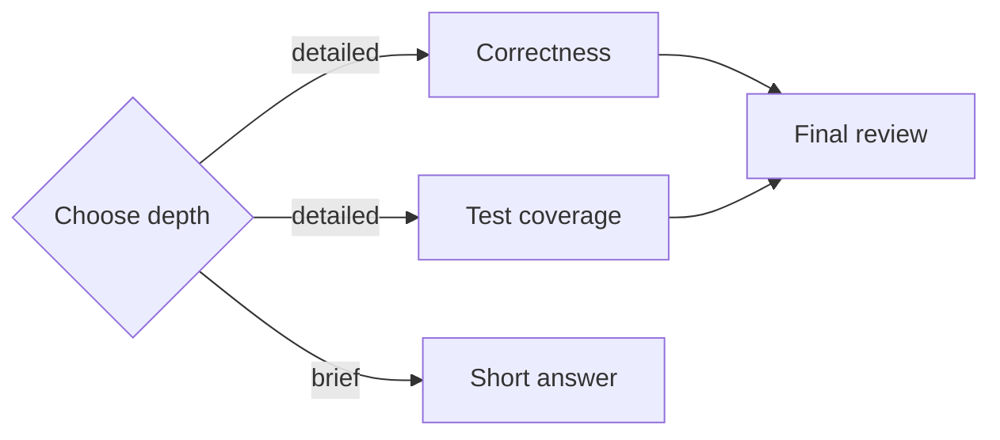

# Braid

Braid is a small TypeScript runtime for LLM agent graphs with bounded loops,
live updates, and isolated Git worktrees. A parent submits a graph, runs
independent invocations concurrently, and can revise the graph or pause and
resume handoffs while it runs. Each execution retains its own outputs and
checkpoints; explicit `integrate` nodes apply selected work to the source checkout.

[](https://github.com/Epsirom/braid/actions/workflows/ci.yml)
[](https://www.npmjs.com/package/@chrok/braid)
[](https://www.npmjs.com/package/@chrok/pi-braid)
[](LICENSE)

**0.2 API:** Experimental, Node.js 22+, ESM. The framework-agnostic core
has no runtime dependencies; the OpenAI-compatible runner and Pi extension are
optional integrations. The npm badges show published versions; see
[GitHub releases](https://github.com/Epsirom/braid/releases) for release notes.
Read the [0.1 → 0.2 migration guide](docs/compatibility.md#migrating-from-01-to-02)
before upgrading. For the previous API, use the
[0.1.3 documentation](https://github.com/Epsirom/braid/tree/v0.1.3).

| Package | Purpose |
| --- | --- |
| [@chrok/braid](https://www.npmjs.com/package/@chrok/braid) | Core runtime and optional OpenAI-compatible runner |
| [@chrok/pi-braid](https://www.npmjs.com/package/@chrok/pi-braid) | Pi background jobs, execution controls, reminders, and live flow panel; installs the matching core dependency |

## What changed in 0.2?

- **Editable graphs, captured executions.** `startBraid` exposes revision-checked
  updates and pause/resume; `executionId` identifies a particular invocation,
  while `nodeId` identifies its reusable definition.
- **Bounded refinement loops.** Explicit feedback edges revisit nodes with fresh
  workspaces. Each loop has a finite iteration limit, and `maxExecutions` caps
  materialized executions across the whole run, including live updates.
- **Explicit workspace integration.** Read-only workers inspect isolated
  predecessor snapshots. `merge` combines changes in a new worktree;
  `integrate` writes to the source checkout. Final integration is never implicit.
- **Per-execution failure policy.** Optional failures keep their errors and
  partial work for recovery. Set `requireSuccess: true` to fail the whole run.

See [execution control](docs/execution-control.md) for the full contract and
[ROADMAP.md](ROADMAP.md) for the current scope and remaining work.

## Why Braid?

For a code review, run correctness and test-coverage analysis independently,
then pass both results to a synthesis node. Add a decision when some tasks need
only a brief answer. Braid handles dependency readiness, conditional skips,
failed joins, per-node context, cancellation, and accounting around those calls.



Use it when independent reasoning branches and explicit handoffs help. A direct
model call or `Promise.all` is enough for a simple answer or independent calls
without routing or joins. Braid adds no persistence, workflow editor, or agent
framework. [Runnable examples](docs/examples.md) show the tradeoffs.

## Install in your application

```sh
npm install @chrok/braid
```

Save this as `example.mjs` and run `node example.mjs` (no API key needed):

```js
import { braid } from "@chrok/braid";
import { mkdtemp, rm } from "node:fs/promises";
import { tmpdir } from "node:os";
import { join } from "node:path";

// A non-Git directory keeps this text-only example outside workspace management.
const cwd = await mkdtemp(join(tmpdir(), "braid-hello-"));
try {
  const result = await braid({
    goal: "Try one isolated invocation.",
    nodes: [{ type: "execute", id: "answer", prompt: "Say hello." }],
    edges: [],
  }, {
    cwd,
    runner: async () => ({ output: "Hello from Braid." }),
  });
  console.log(result.terminalOutputs.answer.output);
  // Hello from Braid.
} finally {
  await rm(cwd, { recursive: true, force: true });
}
```

For a live provider, use the adapter in the API example below. Installation and
running the example above do not make model requests. In a Git checkout, Braid
creates a fresh worktree for each execution. Only explicit `integrate` nodes
write results back to the source checkout. Read [workspace behavior](#worktrees-and-merge-agents)
before running a custom adapter against a repository.

## Install in Pi

With Pi 1.0.1 and Node.js 22.19+:

```sh
pi install npm:@chrok/pi-braid
```

Run `/reload`, ask Pi to analyze a task with Braid, and open `/braid` to inspect
the job. npm installs the exact matching core dependency; no checkout is needed
for published versions. To try 0.2 before publication, follow the
[local Pi installation guide](integrations/pi/README.md#install-this-local-checkout-in-pi).


This snapshot uses the actual panel renderer and fake responses. See the
[Pi guide](integrations/pi/README.md) for background jobs, cancellation, and local
installation, and [compatibility](docs/compatibility.md) for the tested versions.

## Develop from source

```sh
git clone https://github.com/Epsirom/braid.git
cd braid
npm ci
npm run check
npm test
npm run build
npm run demo
```

The demo uses a deterministic fake model runner and makes no network calls. To
run the same graph with an OpenAI-compatible Chat Completions endpoint:

```sh
# Set OPENAI_API_KEY and BRAID_MODEL in your environment first.
npm run demo -- --live
```

`OPENAI_BASE_URL` optionally changes the API root (for example,
`https://your-provider.example/v1`). Live mode makes billable model requests.
The adapter requires a model with function/tool calling support. No live provider
is needed for the test suite; its HTTP requests are intercepted in tests.

## API

After installing the package, submit the graph in one call;
configuration and the trusted provider adapter are separate from the graph data:

```ts
import { braid } from "@chrok/braid";
import { createOpenAICompatibleRunner } from "@chrok/braid/adapters/openai";

const apiKey = process.env.OPENAI_API_KEY;
const model = process.env.BRAID_MODEL;
if (!apiKey || !model) throw new Error("Set OPENAI_API_KEY and BRAID_MODEL");

const result = await braid({
  goal: "Assess a proposed change and give a recommendation.",
  nodes: [
    {
      type: "decision", id: "route", prompt: "Choose a brief answer or a detailed assessment.",
      choices: ["brief", "detailed"], model: process.env.BRAID_ROUTER_MODEL ?? model,
    },
    { type: "execute", id: "benefits", prompt: "Assess the potential benefits." },
    { type: "execute", id: "risks", prompt: "Assess the risks and unknowns." },
    { type: "execute", id: "answer", prompt: "Use the available context to give a recommendation." },
  ],
  edges: [
    { from: "route", to: "answer", choice: "brief" },
    { from: "route", to: "benefits", choice: "detailed" },
    { from: "route", to: "risks", choice: "detailed" },
    { from: "benefits", to: "answer" },
    { from: "risks", to: "answer" },
  ],
}, {
  runner: createOpenAICompatibleRunner({ apiKey }),
  defaultModel: model,
  maxConcurrency: 4,
  nodeTimeoutMs: 60_000,
  graphTimeoutMs: 300_000,
  onEvent: event => console.log(`[${event.type}]`, event),
});

console.log(result.status, result.terminalOutputs);
```

The detailed route starts `benefits` and `risks` concurrently. The brief route
skips both, propagates their inactivity, and runs `answer` with only `route`'s
output. The graph has no special fork, branch, or join nodes.

### Graph schema

```ts
type NodePrompt = string | {
  template: string;
  variables: Readonly<Record<string, string>>;
};
type BraidInputNode =
  | { type: "execute"; id: string; prompt: NodePrompt; model?: string;
      workspace?: "read-only" | "worktree"; notifyOnCompletion?: boolean;
      requireSuccess?: boolean; pauseAfter?: boolean }
  | { type: "decision"; id: string; prompt: NodePrompt;
      choices: readonly string[]; model?: string; workspace?: "read-only" | "worktree"; notifyOnCompletion?: boolean;
      requireSuccess?: boolean; pauseAfter?: boolean }
  | { type: "merge" | "integrate"; id: string; prompt?: NodePrompt; model?: string;
      notifyOnCompletion?: boolean;
      requireSuccess?: boolean; pauseAfter?: boolean };

type Edge = { from: string; to: string; choice?: string; feedback?: string; executionId?: string };
type BraidInput = {
  goal: string;
  nodes: readonly BraidInputNode[];
  edges: readonly Edge[];
  loops?: readonly { id: string; entry: string; maxIterations: number }[];
  promptTemplates?: Readonly<Record<string, string>>;
};
```

IDs are unique, non-empty strings. Goals, models, choices, plain-string prompts,
and rendered prompts must be non-empty strings when present. Decision choices
must be non-empty and unique.
`workspace` is optional on execute/decision nodes and forbidden on merge/integrate
nodes. Both read-only and writable Git executions get isolated predecessor
snapshots; read-only disables write capabilities. Outside Git all filesystem
access is read-only. `notifyOnCompletion` requests host reminders, `pauseAfter`
holds outgoing scheduling, and `requireSuccess` makes failure abort the whole run.
All three booleans default to false.

Unknown fields, missing references, duplicate exact edges, and undeclared cycles
are rejected. Declared structured loops require a finite iteration limit and an
explicit feedback edge. Disconnected components are allowed; every root runs.
Only decision nodes may have choice edges, and choices need not all have exits.

`validateGraph(input)` validates without execution. Invalid graphs raise
`GraphValidationError`; invalid options raise `TypeError`. Optional invocation
failures remain in execution history; required or infrastructure failures make
the run fail. See [execution control](docs/execution-control.md) for the complete
loop, live update, pause/resume, and failure contract.

### Reusable prompt templates

Define shared instructions once in `promptTemplates`, then give each node a
template name and explicit string variables. The same representation is accepted
by the core API and Pi's `braid` tool:

```json
{
  "goal": "Review the runtime and validation code",
  "promptTemplates": {
    "review": "Review {{target}} for {{focus}}. Inspect source and tests, then report findings with file references and supporting evidence."
  },
  "nodes": [
    {
      "type": "execute", "id": "runtime", "workspace": "read-only",
      "prompt": {
        "template": "review",
        "variables": { "target": "src/runtime.ts", "focus": "scheduling and cancellation" }
      }
    },
    {
      "type": "execute", "id": "validation", "workspace": "read-only",
      "prompt": {
        "template": "review",
        "variables": { "target": "src/validate.ts", "focus": "input validation" }
      }
    }
  ],
  "edges": []
}
```

- Placeholders use `{{name}}`, with optional surrounding whitespace inside the
  braces. Names match `[A-Za-z_][A-Za-z0-9_]*`; repeated placeholders reuse the
  same value. Template names are any non-empty strings.
- `variables` is required, including `{}` for a constant template. Values must
  be strings and must match the template's variables exactly. Empty values are
  allowed if the complete rendered prompt is still non-empty.
- Values are inserted literally once: no expressions, recursive expansion,
  escaping, environment lookup, or access to other nodes' outputs. To insert
  literal double braces into a template, pass them as a variable value.
- Unknown templates, missing/unused variables, invalid template syntax, and
  blank rendered prompts throw `GraphValidationError` before any model call.
  All declared templates are syntax-checked, including unused ones. Errors
  identify the template and, for node references/rendering, the affected node.
- Templates work on execute, decision, merge, and integrate prompts. Omitted
  merge/integrate prompts retain their defaults. Plain-string prompts are never rendered,
  even when they contain `{{...}}`.

Templates reduce duplicate text in graph/tool-call arguments; every worker still
receives its fully rendered prompt. Rendering and input snapshotting happen
before asynchronous execution. Templates are local to one submission, with no
saved registry or new runtime dependencies.

`BraidInputNode`, `NodePrompt`, and `PromptTemplateReference` describe compact
inputs. `BraidNode`, `ExecuteNode`, `DecisionNode`, `MergeNode`, `IntegrateNode`,
and `ModelRequest.node` keep their string-prompt types for runners. Core applies the
same non-empty prompt validation after rendering; it does not impose a prompt
length or token cap (see [resource limits](docs/resource-limits.md)).

### Options

| Option | Default | Meaning |
| --- | --- | --- |
| `runner` | Required | A fresh, isolated invocation for each call |
| `defaultModel` | Adapter default | Overridden by each node's `model` |
| `cwd` | `process.cwd()` | Source checkout for core-managed worktrees; non-Git directories grant read-only capabilities |
| `maxExecutions` | `1000` | Total materialized executions, including skipped branches, across all rounds and updates; positive safe integer |
| `maxConcurrency` | `4` | Maximum simultaneous runtime-managed node invocations; positive integer |
| `nodeTimeoutMs` | `60_000` | Separate deadline for each node, starting when it runs (not while queued) |
| `graphTimeoutMs` | `300_000` | Whole execution deadline, including node queueing and paused gates; starts after validation |
| `signal` | None | Caller cancellation signal; aborts running nodes and marks queued nodes cancelled |
| `onEvent` | None | Live observer for graph/node creation, readiness, starts, handoffs, completions, skips, failures, and graph completion |

Timeouts must be positive finite milliseconds, at most `2_147_483_647`, or
`Infinity` to disable that deadline. Set both timeouts to `Infinity` to run
without a time limit; caller cancellation still works.

## Scheduling and routing semantics

Node states are explicit:

```text
pending -> runnable -> running -> completed | failed
pending -> skipped
pending | runnable -> skipped (graph timeout)
```

Edges are resolved from their source node's state:

| Source result | Outgoing edge state |
| --- | --- |
| Not yet finished | Unresolved |
| Completed, unlabelled edge | Active |
| Completed decision, matching choice | Active |
| Completed decision, nonmatching choice | Inactive |
| Skipped because all inputs were inactive | Inactive |
| Failed, unlabelled edge | Active (passes error and available output/workspace) |
| Failed decision, choice-labelled edge | Blocked |
| Skipped because of a failed dependency | Blocked |

Only decision nodes may have choice-labelled outgoing edges. Unlabelled edges
are unconditional, including edges from decisions. A single choice can activate
any number of edges. Choice routing requires successful decision completion.
A decision must call `decide` exactly once with exactly one declared choice;
missing, invalid, or repeated calls fail it. Catching a tool validation error
inside an adapter does not turn that invocation into a success.

A pending node waits until **all incoming edges are resolved**. Then:

1. Any blocked incoming edge makes it `skipped: upstream_failed`.
2. If it has incoming edges but none are active, it becomes `skipped: inactive`.
3. Otherwise it becomes `runnable` (including roots, which have no inputs).

Failures propagate as context through unconditional edges, allowing successors
and merge agents to inspect errors and recover partial work. Failed decisions
cannot activate choice-labelled edges; their unconditional successors can run.
There are no automatic retries. Failures are optional by default; a
`requireSuccess: true` execution failure aborts the whole run, cancels siblings,
and drains writes and cleanup. The policy is captured when the instance is admitted.
Graph deadlines and execution limits remain active while paused.

Nodes are mutable definitions; execution instances retain captured prompts and
inputs. `startBraid` exposes revision-checked `update`, `resume`, `snapshot`, and
`cancel`. Updates can change running nodes, completed nodes, edges, templates, and
loop topology at any time before finalization. Completion uses the latest graph.
See [loops and live updates](docs/execution-control.md) for schemas and examples.

## Execution events

The runtime keeps an immutable `events` log on every execution result and can
stream the same events through `options.onEvent`. Events are numbered and
timestamped. The log is diagnostic data and does not alter scheduling; observer
exceptions and rejected promises are ignored. Event payloads are frozen before
being retained and delivered.

The event sequence includes initial `graph_created`, `node_created`, and
`edge_created`; revision-bearing `graph_updated`; and per-instance
`node_runnable`, `node_started`, `workspace_updated`, `handoff`, `node_completed`,
`node_failed`, or `node_skipped`. Instance events carry `executionId`, admission
`revision`, and optional `loopId`/`iteration`. Handoffs also identify their exact
`fromExecutionId`.

`loop_started`/`loop_completed` report rounds. `execution_paused` and
`execution_resumed` report gates. `graph_completed` or `graph_failed` terminates
the log. Completion/failure is published after checkpointing. Node events repeat
with distinct execution IDs when the same definition runs again.

Use `startBraid` methods to control a run. Event callbacks are observers; throwing
or rejecting does not change scheduler behavior. The Pi panel displays current
topology, iterations, pause gates, and a bounded event preview; complete history
remains available in the result.

## Context isolation and model runners

The core accepts a `ModelRunner` function with this contract:

```ts
import type { ModelRequest } from "@chrok/braid";

type ModelRunner = (request: ModelRequest) => Promise<{
  output: string;
  model?: string;
  usage?: { inputTokens: number; outputTokens: number };
}>;
```

Each request contains the goal, node, resolved model, predecessor outputs,
execution IDs, and an abort signal. Decision nodes additionally receive
`request.decide(choice)`. Expose that callback as an actual model tool; do not
infer decisions by parsing the model's prose. Core assigns `request.workspace`,
provides local `request.git(args, input?)` operations in Git repositories, and
provides `request.merge.sources` and `request.merge.finish(dispositions)` to
merge agents. Adapters must enforce workspace capabilities and wrap mutating
file tools in `request.withWorkspaceWrite(operation)`, so cleanup waits for
in-flight writes and rejects later writes. Core Git mutations use this barrier.
The included Pi adapter provides guarded `write`/`edit` alongside its read tools.
For read-only workspaces, adapters must omit mutating tools; the core write
barrier also rejects writes. This includes all nodes outside Git. Pi never provides
`bash`, `powershell`, or a test runner to nodes.

`request.predecessors` contains direct active predecessors in incoming-edge
order, including failures on unconditional edges with an `error` field. Each source appears once:

```json
[{ "nodeId": "route", "output": "Use a detailed comparison.", "decision": "detailed", "model": "router" }]
```

There is no parent conversation, global transcript, or automatic transitive
history. Each invocation gets fresh node/context objects, so modifying them
cannot affect the graph, another node, or recorded results. Both the submitted
input and options are snapshotted before asynchronous execution. Core manages
worktrees for all adapters; adapters decide which tools expose those capabilities.
Read tools follow the host filesystem permissions and are not a security sandbox.

### Worktrees and merge agents

Every Git execution owns a fresh worktree. Roots use the job's initial snapshot
of tracked edits and non-ignored untracked files without changing the real index.
Successors use immutable predecessor checkpoints; read-only executions use the
same snapshot rules with writes disabled. Independent code branches require an
explicit merge before an ordinary worker consumes them together.

- `merge` combines selected predecessor checkpoints in a **new isolated worktree**.
- `integrate` applies selected results to the **invoking working checkout**.

There is no automatic final integration. Add an explicit integrate node when
results should reach the working branch. Both operations accept optional prompts
and require `finish_merge` with exactly one disposition per source:

```json
{ "dispositions": [
  { "executionId": "<source-execution-id>", "disposition": "integrated", "reason": "Applied the reviewed checkpoint" }
] }
```

The agent chooses merge, cherry-pick, apply, restore, or file edits; core never
chooses for it. Sources include bounded diffs relative to the initial job
snapshot. Integrate also receives the current source checkout's dirty status and
must preserve unrelated user changes. Unresolved conflicts, a missing finish
call, or an `archived` disposition fail the operation.

The model-facing Git tool separates `command` from `args`, for example
`{ "command": "show", "args": ["REF:path"] }`. The programmatic `request.git`
accepts the complete argument array. Duplicate command prefixes, network Git,
branch switching, and filesystem-boundary overrides are rejected.

Instances checkpoint before downstream admission. All source checkpoints remain
reusable; no merge consumes or deletes a predecessor's result. Job cleanup
archives and removes owned worktrees, retaining refs under
`refs/braid/checkpoints/`. Integration additionally captures a pre-write
`backupRef` under `refs/braid/merge-backups/`. Target workspace `dispositions`
record the agent's source selections.

`result.workspaces` is keyed by execution ID; `result.nodes[id].workspace` is the
latest convenience view. Cleaned paths are historical; recover their contents
with `git show <checkpointRef>:path` or inspect changes with
`git diff <snapshotCommit> <checkpointRef>`. Remove reviewed refs explicitly with
`git update-ref -d <ref>`.

Cancellation drains tracked writes before cleanup. Checkpoint/cleanup failures
fail the run and retain unsafe-to-remove paths. Failed integration may leave
partial source edits or conflict state with its backup available for recovery;
it does not reset the checkout. Source integrations serialize within one process;
this does not coordinate parent edits or other processes. Read-only workers remain
isolated from those source edits. See [execution control](docs/execution-control.md).

**The adapter is a trust boundary, not a security sandbox.** It must avoid shared
conversation state, expose only its declared capabilities, and forward `signal` to its provider.
The core never gives the model arbitrary code execution or a recursive Braid
tool. An optional Pi adapter translates this same contract without changing the
runtime; the core package does not depend on Pi. See
[`integrations/pi/README.md`](integrations/pi/README.md) for installation and testing.

The included OpenAI-compatible adapter uses fresh Chat Completions contexts,
a strict `decide({ choice })` tool and one tool-free continuation for decisions.
Merge/integrate nodes use a local `git` / `finish_merge` tool loop; ordinary OpenAI nodes
have no filesystem tools. Pi exposes read and guarded write tools plus these
core Git/merge tools. Tool errors go back to merge agents for recovery. Both
adapters sum usage across their model calls and forward cancellation.
Pi writes reject external paths, Git metadata, symlinks, hard links, and special
files. These checks are not an OS sandbox against concurrent filesystem attacks.
See the [Pi filesystem capabilities](integrations/pi/README.md#node-filesystem-capabilities).

Pi tool and time budgets are unlimited by default. Its `options.maxToolRounds`
and `options.maxToolCalls` can impose positive integer limits per node; counts
include `decide` and rejected requests. Exceeding either limit fails the node
before executing the over-budget batch. Returning final text at the limit is
allowed. See the [Pi budget options](integrations/pi/README.md#node-filesystem-capabilities)
for configuration, including `nodeTimeoutMs` and `graphTimeoutMs`.

For finite budgets, Pi inserts a system reminder with remaining tool and time
budgets before every model call. The OpenAI-compatible adapter also refreshes
finite time-budget reminders before each request. The core supplies optional
`request.deadlines` on the `performance.now()` clock for adapters to calculate
remaining node and shared graph time. Reminders do not extend hard limits or
interrupt a model response already in progress. The core API's default timeouts
remain 60 seconds per node and 5 minutes per graph.

## Results, timeouts, and accounting

`BraidResult` contains:

- `status`: `completed` or `failed`.
- `terminalOutputs`: latest successful unconsumed outputs keyed by node ID.
- `terminalExecutionIds`: exact IDs of the successful execution endpoints.
- `nodes`: latest states/results per node ID, including output, error, usage,
  timing, and workspace metadata. A pending definition has no execution ID yet.
- `executions`: all immutable invocation definitions and their final results,
  keyed by execution ID, including historical rounds and deleted definitions.
- `revision`: the last committed graph revision.
- `workspaces`: execution-keyed workspace states, recovery refs, and merge choices.
- `events`: the immutable execution log described above. `onEvent` observes live
  copies of the same state transitions while the run is in progress.
- `metadata`: run/root identity, timestamps, monotonic latency, summed reported
  token usage, and `usageReportedNodes`. Missing usage is unknown, not proof of
  zero consumption. Usage counts only what the runner actually returns; a
  timeout or provider error may leave billable usage unavailable.
- `error`: one representative error when failed; `nodes` retains all errors.

A node timeout marks the running node `failed: NODE_TIMEOUT`; unconditional
successors can consume its error and partial workspace. A graph timeout marks running nodes `failed: GRAPH_TIMEOUT`,
skips queued/pending nodes with `graph_timeout`, and retains already completed
terminal outputs. Timers are cleared when no longer needed.

Timeouts abort the invocation signal and stop waiting for the model even if it
ignores cancellation. Workspace setup, tracked writes, and cleanup are awaited
to avoid deleting work still being written; this may extend total wall time. Late settlements cannot change the returned results, and late
rejections are observed. JavaScript cannot forcibly preempt synchronous work or
stop an uncooperative remote request: providers must honor cancellation to stop
resource consumption. Concurrency limits cover runtime-managed invocations;
uncancelled provider work after timeout can outlive a slot.

## Internal architecture and scope

- [`src/types.ts`](src/types.ts): public graph, provider, and result types.
- [`src/validate.ts`](src/validate.ts): strict validation, graph snapshot,
  dependency indexes, and iterative validation of acyclic regions and structured loops.
- [`src/runtime.ts`](src/runtime.ts): edge resolution, explicit state transitions,
  bounded concurrent scheduling, invocation deadlines, execution events, and result accounting.
- [`src/workspaces.ts`](src/workspaces.ts): Git snapshots, checkpoint refs, merge
  serialization, local Git tools, and worktree cleanup.
- [`src/adapters/openai.ts`](src/adapters/openai.ts): optional provider translation.
- [`integrations/pi/`](integrations/pi/): thin Pi model-registry/tool adapter, Mermaid graph renderer, and live execution renderer (`display.ts`).
- [`test/`](test/): deterministic scheduling, execution-event, and intercepted HTTP/tool tests.

There is one in-memory execution context per run, plus a process-local mutex
per source checkout for integrate agents. Worktree registration and removal are
serialized per common Git directory within the process; model calls remain
concurrent. These locks do not coordinate other processes. `rootRunId` equals
`runId`. Centralized invocation admission and
usage aggregation leave places to thread a shared root budget in a future
nested-run implementation; **nested runs and shared budget enforcement are not
implemented**. The current scheduler deliberately rescans a small graph after
completions; `onEvent` is an observer for diagnostics and visualization, not a
scheduler event bus.

Out of scope: arbitrary/unstructured cycles, nested/overlapping loops, arbitrary
code nodes, durable workflow recovery, saved templates, a graphical editing UI,
and recursive Braid calls from model nodes.

## Contributing and project status

Start with [CONTRIBUTING.md](CONTRIBUTING.md) for setup and verification,
[ROADMAP.md](ROADMAP.md) for scope, and [CHANGELOG.md](CHANGELOG.md) for changes.
See [compatibility](docs/compatibility.md), [resource limits](docs/resource-limits.md),
and [scheduler benchmarks](docs/benchmark.md) before adopting Braid for a service.
Questions and bugs belong in [GitHub issues](https://github.com/Epsirom/braid/issues);
report vulnerabilities privately as described in [SECURITY.md](SECURITY.md).
Participation follows the [code of conduct](CODE_OF_CONDUCT.md).

## License

Braid is released under the [MIT License](LICENSE).
